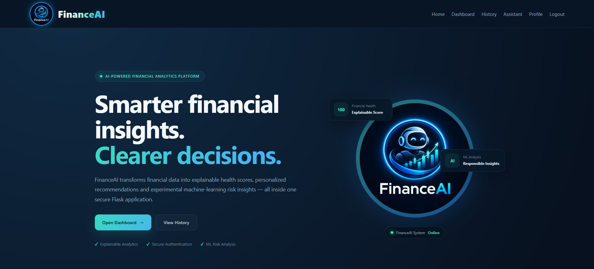
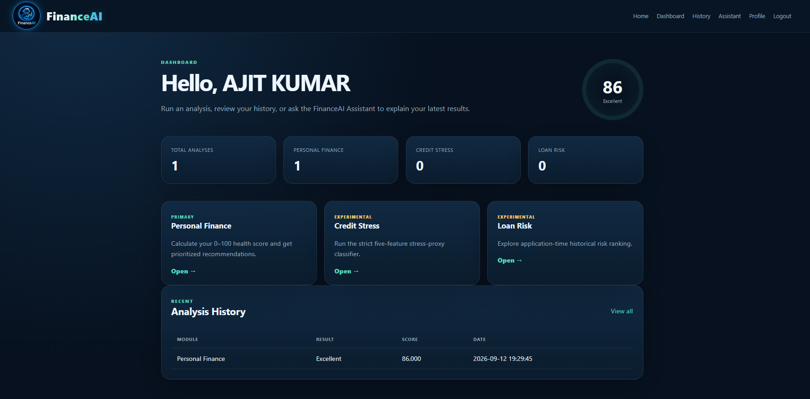

# FinanceAI — Intelligent Personal Finance & Risk Analysis System

FinanceAI is a **Flask-based personal finance and risk-analysis portfolio project** developed as a four-member B.Tech CSE team project. It combines authentication, database persistence, explainable financial-health scoring, machine-learning experiments, APIs, analysis history, and a Local TF-IDF RAG assistant in one integrated application.

The project is designed as an educational and portfolio-grade financial analytics system. It provides a transparent Personal Finance module and two carefully labeled experimental ML modules: Credit Stress and Loan Risk.

## FinanceAI v2.0 Final — VS Code Full Working Build

This package keeps the original FinanceAI documentation and project structure while consolidating the latest routing, readability, ML, history and VS Code improvements into a clean **FinanceAI 2.0** build. The FinanceAI Assistant works locally with TF-IDF RAG and does not require an external AI API.

### What is updated in v2.0

- Fixed the Budget Planner Jinja `dict.items` collision that caused `TypeError: 'builtin_function_or_method' object is not iterable`.
- Fixed the same hidden `.items` collision in Spending Insights.
- Added stronger session/routing behavior so logged-out users cannot receive protected Dashboard pages.
- Added no-cache headers to session-dependent pages to prevent stale Login/Dashboard rendering.
- Added `/version` so you can confirm the exact running build: `2.0.0`.
- Loan Risk shows **full U.S. state names** such as `New Jersey (NJ)` while still submitting the historical state codes expected by the trained 2018 U.S. model.
- Credit Stress and Loan Risk results are shown as **Low / Moderate / High educational signals** with readable explanations and action steps.
- Analysis History is presented in readable tables instead of raw JSON, with simple meanings, dates, PDF reports and CSV export.
- Transaction ledger, monthly budgets, 50/30/20 planner, goals, net worth, 30/60/90 forecast, Isolation Forest anomalies and K-Means spending behavior are integrated.
- FinanceAI Assistant uses **Local TF-IDF RAG only** and does not require an external AI provider or API key.
- VS Code Run/Debug and Task configuration is included.
- Windows setup, verification and start scripts consistently use the `venv` virtual environment folder.
- End-to-end Flask route smoke tests are included.

### Recommended Windows + VS Code workflow

> Use a **new folder** for this version. Do not extract it over an older FinanceAI folder because old Python files, `.env`, database files or an old server can make the browser show the wrong build.

#### 1. Requirements

Install:

- **Python 3.11 or 3.12**
- **Visual Studio Code**
- VS Code **Python** extension (`ms-python.python`)
- Internet access only for the first-time `pip install`

Check Python in the VS Code terminal:

```powershell
py --version
```

#### 2. Open the project correctly in VS Code

Extract the ZIP, then open the **project root folder** in VS Code. The Explorer should show files such as:

```text
app.py
requirements.txt
setup_windows.bat
verify_windows.bat
START_FINANCEAI.bat
templates/
services/
models/
.vscode/
```

Do not open only the `templates` or `services` folder.

#### 3. First-time setup

You can use the one-click setup:

```bat
setup_windows.bat
```

Or use the VS Code PowerShell terminal manually:

```powershell
py -m venv venv
.\venv\Scripts\Activate.ps1
python -m pip install --upgrade pip
pip install -r requirements.txt
Copy-Item .env.example .env
python init_db.py
```

If PowerShell blocks activation for the current terminal, run:

```powershell
Set-ExecutionPolicy -Scope Process -ExecutionPolicy Bypass
.\venv\Scripts\Activate.ps1
```

The setup script also creates `.env` when needed, generates a random Flask `SECRET_KEY`, and initializes the database.

For a complete manual VS Code PowerShell flow, you can run exactly:

```powershell
py -m venv venv
.\venv\Scripts\Activate.ps1
python -m pip install --upgrade pip
pip install -r requirements.txt
Copy-Item .env.example .env
python init_db.py
python smoke_test.py
python app.py
```

#### 4. Verify the full project

Run:

```bat
verify_windows.bat
```

It runs:

```text
smoke_test.py     -> database + trained models + forecast + anomalies + K-Means + Local RAG
web_smoke_test.py -> Flask auth/routes/templates/history/PDF/core pages
```

#### 5. Run from VS Code

Select the project interpreter if VS Code does not select it automatically:

**Ctrl + Shift + P → Python: Select Interpreter → `venv\Scripts\python.exe`**

Then use either method:

**Method A — VS Code Run & Debug**

1. Open **Run and Debug**.
2. Select **FinanceAI 2.0 - Run Flask App**.
3. Press **F5**.

**Method B — VS Code Terminal**

```powershell
.\venv\Scripts\Activate.ps1
python app.py
```

**Method C — one-click Windows launcher**

```bat
START_FINANCEAI.bat
```

Open:

```text
http://127.0.0.1:5050/login
```

Version check:

```text
http://127.0.0.1:5050/version
```

Expected version:

```text
2.0.0
```

#### 6. Test the Local FinanceAI Assistant

After login:

1. Open **FinanceAI Assistant**.
2. Ask a question such as:

```text
Mere current month ke expenses analyze karke simple Hindi me batao ki savings kaise improve kar sakta hoon.
```

The Assistant uses FinanceAI's local knowledge base plus a limited summary of the user's current account data. No external AI API key is required.

### VS Code troubleshooting

If VS Code says a package such as Flask is missing, select:

**Ctrl + Shift + P → Python: Select Interpreter → `venv\Scripts\python.exe`**

If the browser opens an old FinanceAI version, stop every old terminal with `Ctrl + C`, then use only port `5050` and check `/version`.

If PowerShell blocks activation, use the Process-only execution-policy command shown above, use Command Prompt, or run directly:

```powershell
.\venv\Scripts\python.exe app.py
```

---

## FinanceAI v1.1.0 UI & Experience Update

The current build adds a more polished application experience without changing the responsible-use boundaries of the analytics modules.

- Smart first-visit FinanceAI splash screen with animated initialization states
- Modern Flask toast notifications for success, warning, info, and error messages
- Analysis processing overlay for Personal Finance, Credit Stress, and Loan Risk forms
- Scroll-reveal motion for the main home-page sections
- Animated floating hero insight cards
- Larger teal/blue FinanceAI branding and responsive header refinements
- Team profile-image support with automatic initials fallback when an image is unavailable
- Privacy Policy and Terms & Disclaimer pages
- Downloadable PDF reports for saved analyses
- Professional four-column footer with resources, project status, responsible-use notice, and centered copyright
- Floating Back to Top control
- Custom 500 error page and improved keyboard focus visibility

## Project Screenshots

### Home Page



### User Dashboard



> The screenshots above are generated from the current FinanceAI interface included in this project package.

### Team Photo Setup

Team photos do not require a database. Put profile images in `static/team/` using these filenames:

```text
static/team/ajit.png
static/team/ajeet.png
static/team/sonu.png
static/team/pranav.png
```

If a file is missing, the UI automatically falls back to the member initials.

---

## Project Team

| Member | Role | Primary Responsibility |
|---|---|---|
| **Ajit Kumar** | **Team Leader · Full-Stack & Integration Lead** | Overall architecture, Flask backend, authentication, database integration, APIs, module integration, validation, deployment flow and project coordination |
| **Ajeet Kumar** | **Personal Finance & Data Analytics Lead** | Personal Finance analytics, health-score logic, recommendations, result interpretation and module testing |
| **Sonu Kumar** | **Credit Stress ML & Explainability Lead** | Credit Stress preprocessing, leakage-safe features, Logistic Regression, threshold tuning, metrics and explainability |
| **Pranav Kr Mishra** | **Loan Risk ML, Testing & Documentation Lead** | Loan Risk preprocessing, Extra Trees workflow, diagnostics, testing, input schema and documentation support |

> This responsibility split is the recommended project allocation for documentation, demonstration and presentation. All four members may jointly contribute to testing, review, documentation and presentation preparation.

---

## Problem Statement

Personal-finance users often have financial data but do not have one simple system that explains:

- their current financial health,
- which areas require improvement,
- how risk signals can be analyzed,
- how past analyses can be stored and compared,
- and how finance-related ML systems should communicate their limitations.

FinanceAI addresses this by combining explainable finance rules, machine-learning experiments, a secure Flask application, database persistence and APIs.

---

## Project Objective

The main objective of FinanceAI is to create a unified financial analytics platform that can:

1. Help users understand their financial condition through an explainable **0–100 Financial Health Score**.
2. Generate prioritized educational recommendations from current financial indicators.
3. Demonstrate an experimental **Credit Stress** classification workflow using leakage-safe predictors.
4. Demonstrate an experimental **Loan Risk** ranking workflow using application-time borrower features.
5. Store user accounts and analysis history using SQLite or MySQL.
6. Provide both a professional browser UI and JSON API endpoints.
7. Provide a Local TF-IDF RAG FinanceAI Assistant that works locally without an external AI API.
8. Clearly separate educational analytics from real credit or lending decisions.

---

## Final Features

- User registration
- User login / logout
- Password change
- Secure password hashing
- CSRF protection for browser forms
- Basic login rate limiting
- Session-based authentication
- Personal Finance Health Score (0–100)
- Explainable component-wise scoring
- Personalized prioritized recommendations
- Credit Stress experimental Logistic Regression module
- Loan Risk experimental Extra Trees module
- STEP 7 tuned thresholds
- Analysis history per user
- CSV history export
- Offline FinanceAI Assistant using latest saved Personal Finance result
- JSON API endpoints
- SQLite out-of-the-box
- Optional MySQL / XAMPP backend
- Professional responsive UI
- Smart FinanceAI startup splash experience
- Analysis loading overlay
- Toast notifications
- Scroll reveal animations
- Privacy Policy and Terms & Disclaimer pages
- Downloadable PDF analysis reports
- Team-image fallback support
- Back to Top navigation
- Custom 500 error page
- Sample inputs
- Smoke tests
- Exact scikit-learn version pinned to 1.8.0
- Responsible-use warnings for experimental ML modules
- Transaction ledger with add/edit/delete
- CSV transaction import/export and demo transaction data
- Monthly budget limits and 50/30/20 planner
- Financial goals and progress tracking
- 30/60/90 day cash-flow forecasting
- Isolation Forest unusual-spending detection
- K-Means spending behavior grouping
- Net-worth tracking for assets, investments, and liabilities
- Government scheme explorer
- Local TF-IDF RAG assistant with account-aware finance context
- VS Code Run/Debug and Task configuration under `.vscode/`
- Model Lab
- Human-readable analysis-history tables, CSV export, and PDF reports
- Full Loan Risk state names with model-compatible historical state codes
- Windows verification script and end-to-end web smoke test

---

## Technologies Used

### Backend

- Python
- Flask
- Session-based authentication
- SQLite / MySQL
- JSON APIs

### Machine Learning / Data Science

- pandas
- NumPy
- scikit-learn
- Logistic Regression
- Extra Trees
- StandardScaler
- OneHotEncoder
- ColumnTransformer
- Stratified validation
- PR-AUC / ROC-AUC / Precision / Recall / F1 / MCC

### Frontend

- HTML
- CSS
- Jinja2
- Responsive custom UI

### Reporting

- ReportLab PDF generation

### Development / Testing

- Python virtual environment
- Smoke tests
- Sample JSON inputs
- XAMPP / MySQL optional configuration

---

## System Architecture

```text
User / Browser / API Client
            │
            ▼
        Flask App
            │
    ┌───────┼─────────────┐
    │       │             │
    ▼       ▼             ▼
Auth    Validation     API Routes
    │       │             │
    └───────┼─────────────┘
            ▼
        Service Layer
            │
 ┌──────────┼───────────────┐
 │          │               │
 ▼          ▼               ▼
Personal   Credit Stress   Loan Risk
Finance    Logistic Reg.   Extra Trees
Engine
 │          │               │
 └──────────┼───────────────┘
            ▼
      SQLite / MySQL
            │
            ▼
 History · Dashboard · Assistant
```

---

# Module 1 — Personal Finance

This is the **primary user-facing module**.

## Purpose

The module converts current financial information into a transparent Financial Health Score and recommendations.

## Main Inputs

- Monthly income
- Monthly expenses
- Debt-to-income ratio
- Loan payment
- Investment amount
- Emergency fund
- Credit score
- Budget goal
- Actual savings
- Subscription count
- Financial stress level

## Financial Health Score

The score is transparent and totals **100 points**:

| Component | Maximum Points |
|---|---:|
| Cash Flow | 25 |
| Debt Health | 20 |
| Emergency Fund | 20 |
| Savings Progress | 15 |
| Investment | 10 |
| Credit | 10 |
| **Total** | **100** |

## Health Bands

- **Excellent:** 85–100
- **Good:** 70–84
- **Moderate:** 55–69
- **Weak:** 40–54
- **Critical:** 0–39

## Output

- Financial Health Score
- Health category
- Component breakdown
- Expense-to-income ratio
- Loan-to-income ratio
- Investment ratio
- Emergency-fund months
- Savings goal progress
- Prioritized recommendations
- Saved analysis history

## Personal Finance Limitation

The module is designed for educational financial-health guidance. It is not professional investment, banking, tax or financial-planning advice.

---

# Module 2 — Credit Stress

## Model

**Logistic Regression**

## Target

```text
financial_stress_flag
```

The target is a **rule-based financial-stress proxy**.

The proxy is constructed using conditions such as:

- Negative disposable income
- Expense-to-income ratio above 90%
- Loan-to-income ratio above 20%

## Strict Leakage-Safe Predictors

To avoid directly reconstructing the target, the benchmark uses only:

- Age
- Dependents
- Occupation
- City_Tier
- Desired_Savings_Percentage

## STEP 6 / 7 Results

- Champion: **Logistic Regression**
- CV PR-AUC: approximately **0.2275**
- Test PR-AUC: approximately **0.2334**
- Test ROC-AUC: approximately **0.8539**
- Default Recall: approximately **0.8727**
- STEP 7 tuned threshold: **0.68**
- Tuned Recall: approximately **0.8218**
- Tuned Precision: approximately **0.2514**
- Tuned F1: approximately **0.3850**
- Tuned MCC: approximately **0.3886**
- Top-decile lift: approximately **3.82×**

## Credit Stress Limitation

The target is **not observed credit default, delinquency, charge-off or missed payment**.

Therefore this module is an experimental classification demonstration and must not be presented as a real credit-approval or rejection engine.

---

# Module 3 — Loan Risk

## Model

**Extra Trees**

## Purpose

The model ranks historical borrower/application records by experimental risk using application-time features.

## Main Modeling Characteristics

- Application-time features
- Leakage review
- Rare-event target
- Severe class imbalance
- Temporal holdout
- PR-AUC-focused evaluation
- Threshold tuning
- Error diagnostics
- Feature importance
- Input schema validation

## Important Results

- Champion: **Extra Trees**
- Test ROC-AUC: approximately **0.6487**
- Test PR-AUC: approximately **0.0326**
- STEP 7 tuned threshold: approximately **0.2320**
- Rare positive class
- Limited historical observation window

## Integration Safety

The Loan Risk API requires the complete expected application-time feature schema.

Incomplete records are rejected rather than silently filled and presented as reliable decisions.

## Loan Risk Limitation

The model is an **experimental historical risk-ranking model**.

It is not approved for automated lending, sanctioning, pricing or approval/rejection decisions.

---

# Authentication & Security

FinanceAI includes:

- Registration
- Login
- Logout
- Password hashing
- Password change
- Session-based authentication
- CSRF protection on browser forms
- Basic login throttling
- User-specific analysis history
- Input validation

For a real financial production environment, additional requirements would include:

- HTTPS everywhere
- MFA
- centralized secrets management
- full audit logs
- monitoring
- secure backups
- penetration testing
- privacy controls
- compliance review
- fairness review
- incident response

---

# Database

FinanceAI supports two database modes.

## Option A — SQLite

Recommended for instant demo.

`.env`:

```env
DB_BACKEND=sqlite
SQLITE_PATH=instance/financeai.db
```

Then:

```powershell
python init_db.py
python app.py
```

## Option B — MySQL / XAMPP

Create the database:

```sql
CREATE DATABASE financeai
CHARACTER SET utf8mb4
COLLATE utf8mb4_unicode_ci;
```

Set `.env`:

```env
DB_BACKEND=mysql
MYSQL_HOST=127.0.0.1
MYSQL_PORT=3306
MYSQL_USER=root
MYSQL_PASSWORD=
MYSQL_DATABASE=financeai
```

Then:

```powershell
python init_db.py
python app.py
```

---

# Quick Start on Windows / VS Code Terminal

From the project folder:

```powershell
py -m venv venv
.\venv\Scripts\Activate.ps1
python -m pip install --upgrade pip
pip install -r requirements.txt
Copy-Item .env.example .env
python init_db.py
python smoke_test.py
python app.py
```

Open:

```text
http://127.0.0.1:5050
```


# Web Routes

- `/` — Landing page
- `/about` — Project details, architecture, limitations and team
- `/register`
- `/login`
- `/dashboard`
- `/personal-finance`
- `/credit-stress`
- `/loan-risk`
- `/history`
- `/assistant`
- `/profile`
- `/transactions`
- `/budget`
- `/goals`
- `/forecast`
- `/spending-insights`
- `/net-worth`
- `/schemes`
- `/model-lab`
- `/version`

---

# API Routes

- `GET /api/v1/status`
- `POST /api/v1/personal-finance`
- `GET /api/v1/credit-stress/schema`
- `POST /api/v1/credit-stress`
- `GET /api/v1/loan-risk/schema`
- `POST /api/v1/loan-risk`
- `GET /api/v1/history` — login required
- `GET /api/v1/transactions` — login required
- `GET /api/v1/forecast` — login required
- `GET /api/v1/spending-insights` — login required
- `GET /api/v1/net-worth` — login required

---

# FinanceAI Assistant — Local TF-IDF RAG

The Assistant uses the user's FinanceAI account summary plus a Local TF-IDF RAG knowledge base. It works locally without an external AI provider and can explain concepts such as:

- What does my score mean?
- How can I improve my financial health?
- Why is my emergency fund important?
- What should I focus on first?

The Assistant is educational and does not provide professional financial advice.

---

# Analysis History

Authenticated users can save and review past analyses.

History can contain:

- Module name
- Score/result
- Timestamp
- Analysis details
- CSV export

This demonstrates database-backed persistence rather than only one-time predictions.

---

# Team Responsibilities

## Ajit Kumar — Team Leader · Full-Stack & Integration Lead

### Main Responsibilities

- Team coordination
- Project planning
- Overall architecture
- Flask backend
- Authentication system
- Database integration
- API integration
- Module integration
- Dashboard integration
- Validation
- Deployment workflow
- Final presentation coordination

### Presentation Part

- Team introduction
- Problem statement
- Objectives
- System architecture
- Flask/backend
- Authentication/database
- Unified integration
- APIs
- Final conclusion
- Future scope

---

## Ajeet Kumar — Personal Finance & Data Analytics Lead

### Main Responsibilities

- Personal Finance dataset understanding
- EDA support
- Health-score logic interpretation
- Recommendation workflow
- Personal Finance module testing
- Result interpretation
- History-flow demonstration

### Presentation Part

- Personal Finance module
- Inputs
- Health Score
- Six score components
- Recommendations
- Saved history

---

## Sonu Kumar — Credit Stress ML & Explainability Lead

### Main Responsibilities

- Credit Stress dataset preparation
- Leakage review
- Strict feature selection
- ML preprocessing
- Logistic Regression modeling
- Evaluation
- Threshold tuning
- Explainability
- Model limitation documentation

### Presentation Part

- Credit Stress workflow
- Target definition
- Logistic Regression
- PR-AUC / ROC-AUC
- Threshold 0.68
- Coefficients / explainability
- Proxy-target limitation

---

## Pranav Kr Mishra — Loan Risk ML, Testing & Documentation Lead

### Main Responsibilities

- Loan Risk data preparation
- Target and imbalance analysis
- Feature engineering
- Extra Trees model
- Threshold diagnostics
- Input validation
- Testing
- Documentation support
- Demo support

### Presentation Part

- Loan Risk workflow
- Target
- Class imbalance
- Extra Trees
- Model metrics
- Threshold
- Input schema
- Experimental limitation

---

# Shared Team Responsibilities

All four members can jointly contribute to:

- Dataset checking
- Testing
- UI review
- Bug fixing
- Documentation review
- Presentation preparation
- Viva preparation
- Final demo validation

---


# Future Scope

Possible improvements include:

- Real bank transaction integration
- Real credit-card repayment data
- Actual verified credit-default target
- Larger loan outcome history
- Longer temporal validation
- Better calibrated probabilities
- Bias and fairness assessment
- Admin dashboard
- Role-based access control
- Email alerts
- Budget planning
- Investment goal tracking
- Secure cloud deployment
- Mobile app / PWA
- Advanced AI assistant with user-approved financial context

---

# Responsible-Use Boundary

FinanceAI is a **portfolio, educational and research/demo system**.

The Personal Finance module provides explainable educational guidance.

The Credit Stress and Loan Risk modules are experimental ML demonstrations.

**FinanceAI must never be used to automatically approve or reject a credit card, loan or any other financial product.**


## 📂 Project Structure

```text
FinanceAI/
│
├── .env
├── FINAL_VALIDATION.json
├── README.md
├── app.py
├── config.py
├── database.py
├── init_db.py
├── smoke_test.py
├── requirements.txt
│
├── database/
│   ├── schema_mysql.sql
│   └── schema_sqlite.sql
│
├── docs/
│   ├── API.md
│   ├── DEPLOYMENT.md
│   ├── FINAL_DEMO_GUIDE.md
│   ├── FINAL_REPORT.md
│   ├── MYSQL_XAMPP.md
│   ├── PROJECT_STATUS.md
│   ├── SECURITY.md
│   └── TEAM.md
│
├── models/
│   ├── credit_card/
│   │   ├── credit_card_model_candidate_pipeline.pkl
│   │   ├── credit_card_step6_model_metadata.json
│   │   ├── credit_card_step7_diagnostics_summary.json
│   │   └── credit_card_step7_threshold_config.json
│   │
│   └── loan_risk/
│       ├── loan_risk_model_candidate_pipeline.pkl
│       ├── loan_risk_step6_model_metadata.json
│       ├── loan_risk_step7_diagnostics_summary.json
│       └── loan_risk_step7_threshold_config.json
│
├── samples/
│   ├── credit_stress_sample.json
│   ├── loan_risk_sample.json
│   └── personal_finance_sample.json
│
├── services/
│   ├── __init__.py
│   ├── assistant.py
│   ├── financial_health.py
│   ├── loan_feature_builder.py
│   ├── model_service.py
│   ├── recommendation_engine.py
│   ├── security.py
│   └── system_status.py
│
├── static/
│   ├── css/
│   │   └── style.css
│   └── js/
│       └── app.js
│
└── templates/
    ├── base.html
    ├── home.html
    ├── dashboard.html
    ├── about.html
    ├── assistant.html
    ├── profile.html
    │
    ├── auth/
    │   ├── login.html
    │   └── register.html
    │
    ├── errors/
    │   ├── 400.html
    │   └── 404.html
    │
    ├── history/
    │   ├── list.html
    │   └── detail.html
    │
    └── modules/
        ├── personal_finance.html
        ├── personal_finance_result.html
        ├── credit_stress.html
        ├── loan_risk.html
        └── model_result.html
```

---

##  Architecture Overview

- **Frontend:** HTML, CSS, JavaScript, Bootstrap
- **Backend:** Python, Flask
- **Database:** MySQL / SQLite
- **Machine Learning:** Scikit-learn
- **Security:** Password Hashing, Input Validation, Session Management
- **AI Modules:**
  - Personal Finance Health Analysis
  - Credit Stress Prediction
  - Loan Risk Assessment
  - Financial Recommendations
  - AI Financial Assistant

---
---

# Documentation

The `docs/` folder contains:

- `FINAL_REPORT.md`
- `FINAL_DEMO_GUIDE.md`
- `TEAM.md`
- `API.md`
- `SECURITY.md`
- `DEPLOYMENT.md`
- `MYSQL_XAMPP.md`
- `PROJECT_STATUS.md`

---

# Team

**FinanceAI — Four Member B.Tech CSE Project Team**

**Team Leader:** Ajit Kumar

**Members:** Ajeet Kumar · Sonu Kumar · Pranav Kr Mishra

---

# Disclaimer

FinanceAI is an educational and portfolio-based project.

The Credit Stress and Loan Risk modules are experimental machine learning demonstrations and must not be used for actual loan approval, credit approval, or financial decision-making.

---

#  License

This project is developed for educational, academic, and portfolio purposes only.

© 2026 FinanceAI Team. All Rights Reserved.

---

# Historical Note — FinanceAI 2.0 Full Feature Update

FinanceAI 2.0 is the consolidated full-feature build described at the top of this README. The original Personal Finance, Credit Stress, Loan Risk, authentication, analysis history, PDF report and REST API modules are preserved, and the following production-style demo features are now integrated with the same user account and database.

## Added in this build

- Income/expense transaction ledger with recurring flag and payment method
- CSV transaction import and export
- Six-month synthetic demo-data loader for presentations
- Monthly category budgets with actual-vs-limit tracking
- 50/30/20 baseline budget planner
- Goal planner with progress, remaining amount, months left and required monthly saving
- 30/60/90-day cash-flow forecast using Linear Regression when enough history exists, with moving-average fallback
- Spending-behavior analysis with K-Means category clustering when enough categories exist
- Unusual-spending detection with Isolation Forest when enough transactions exist
- Net-worth tracker for assets, investments and liabilities
- Government-scheme discovery page with responsible-use notices
- Local TF-IDF RAG assistant grounded in FinanceAI knowledge plus the user's account snapshot
- Model Lab showing trained-model thresholds, feature counts and current analytics methods
- New JSON endpoints for transactions, forecast, spending insights and net worth
- Expanded dashboard with current-month cash flow, net worth, goals, forecast and anomaly status
- SQLite and MySQL schemas for every new persistent module
- Windows and Linux setup/run scripts

## Fast start on Windows

1. Extract the ZIP.
2. Double-click `setup_windows.bat` once while internet access is available for dependency installation.
3. Run `verify_windows.bat`.
4. Run `START_FINANCEAI.bat` or press F5 in VS Code.
5. Open `http://127.0.0.1:5050/login`.
6. Create an account, open **Transactions**, and either add real entries or load the synthetic demo data.

## Local FinanceAI Assistant

The FinanceAI Assistant works locally without any external AI API. It retrieves relevant chunks from `knowledge/finance_knowledge.json` using TF-IDF and combines them with the user's current-month cash flow, net worth, active-goal count and recent risk-analysis context.

## Responsible-use boundaries

FinanceAI is an educational/student analytics project. Forecasts are estimates. Anomaly flags are not proof of fraud. Credit Stress is a proxy rather than an official bureau score or default probability. Loan Risk is an experimental historical ranking signal and must not be used as an autonomous approval, rejection, pricing or credit-limit decision.


## Decision Intelligence Update (2.0.1)
- What-If Simulator: salary, expense, discretionary-spend and EMI scenarios.
- Emergency Fund Planner: corpus target, coverage, gap and months-to-target.
- Smarter Indian CSV import: supports debit/credit/narration/merchant fields, UPI detection and merchant category suggestions.
- Goal Planner: progress, remaining amount and monthly contribution required.
- Existing ML analytics retained: forecast, Isolation Forest anomalies, K-Means spending behavior, health score, recommendations, credit stress and experimental loan risk.
